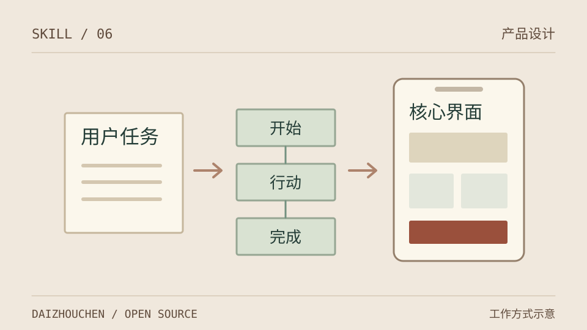

# Product Designer

把产品想法整理为可讨论、可修改的设计稿：用户任务、MVP 范围、核心界面和流程，放在一份 HTML 中。



这是一个 Claude Code Skill。根据任务选择理论卡和图形模板；已有方案可以局部修改，早期想法可以先明确问题和待验证假设。交付物是产品设计文档，线框用于表达方案。

## 安装

在支持 Bash 的终端执行；目标目录已有文件时，先检查现有版本。

```bash
mkdir -p "$HOME/.claude/skills"
git clone https://github.com/daizhouchen/claude-product-designer.git "$HOME/.claude/skills/product-designer"
```

在 Claude Code 中显式使用：`用 product-designer 帮我设计……`。自动选择由宿主工具决定。

## 怎么用

给出目标用户、要完成的任务和已有约束。缺失信息会作为问题或假设处理，已有结论可以直接沿用。

> 用 product-designer 为销售团队设计客户回顾工作台，先明确 MVP 范围和核心流程，输出 HTML 设计稿。

默认文件为当前工作目录下的 `<产品名>-design.html`，也可指定位置。后续可以只调整某个流程、功能或章节，无需重做整份方案。

## 仓库内容

| 文件 | 用途 |
|---|---|
| [SKILL.md](SKILL.md) | 任务范围、设计过程与交付检查 |
| [references/theories/](references/theories/) | 探索、定义、决策、设计、度量五组理论卡，按需阅读 |
| [assets/template.html](assets/template.html) | 可删减的 HTML 文档模板 |
| [assets/svg/](assets/svg/) | 8 个线框、流程、功能矩阵等 SVG 模板 |
| [evals/evals.json](evals/evals.json) | 行为验收场景与检查项 |

## 交付约定

- 具体方案说明产品形态、功能边界、关键界面与用户流程；探索阶段可以保留候选方向，明确哪些决定尚未做出。
- 理论只用于解释当前问题，不要求填满五幕或达到固定行数。
- 区分用户提供的信息、可追溯来源和待验证假设；不虚构访谈、市场规模或产品效果。
- HTML 内联样式和采用的 SVG，检查占位符、排版与打印效果。模板使用本机字体及后备字体，显示效果随设备略有不同。

评测文件是验收设计，仓库没有完整的逐次生成物和评分记录；因此不把旧版 README 的通过率当作可复现性能承诺。

## 来源与许可

视觉范式参考 [book-distiller](https://github.com/zhouwong/book-distiller)，理论参考 Marty Cagan、俞军、Julie Zhuo、Ash Maurya 与 Christensen 的产品设计工作。源文件采用 [MIT License](LICENSE)。
